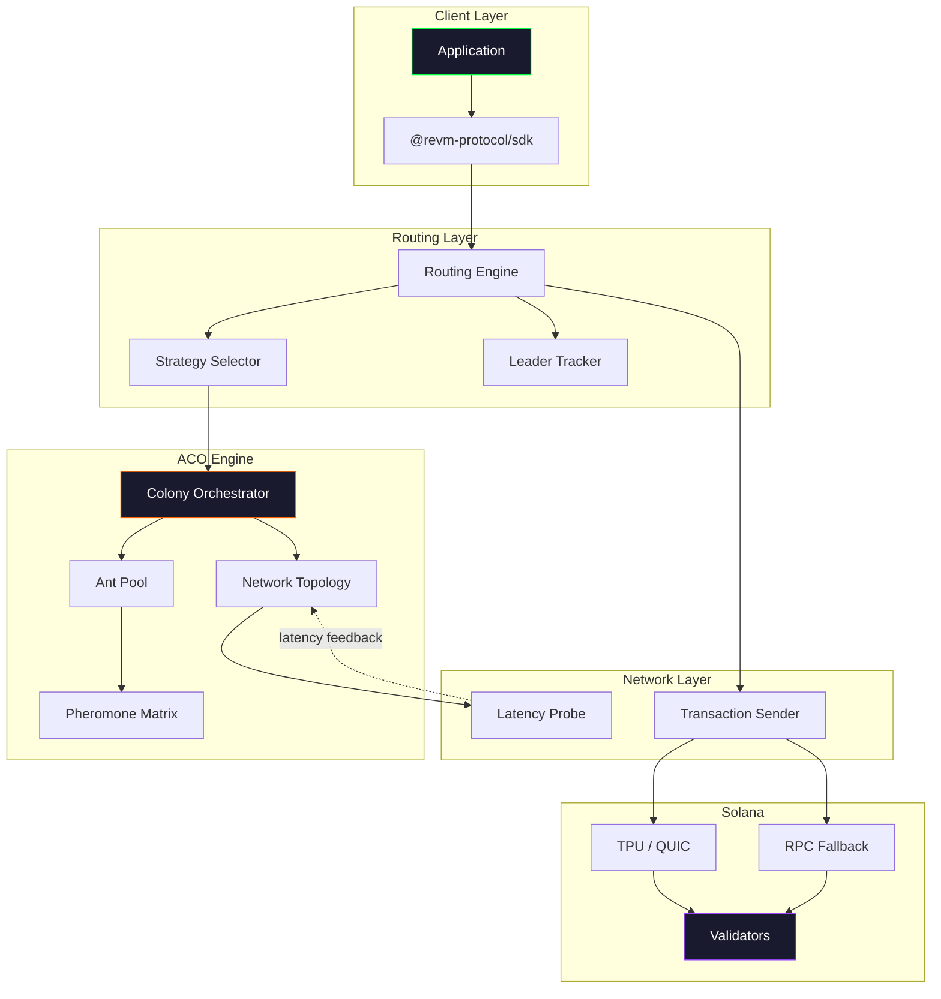

<p align="center">
  
</p>

<p align="center">
  <strong>REVM CORE</strong><br/>
  Ant Colony Optimization Routing Engine for Solana
</p>

<p align="center">
  <a href="https://revmdotio.github.io/revm-core/"></a>
  <a href="https://revm.io"></a>
  <a href="https://x.com/revmdotio"></a>
  <a href="https://github.com/revmdotio/revm-core/blob/main/LICENSE"></a>
  
  
  
</p>

<p align="center">
  Sub-10ms path selection. Single-hop delivery. Zero MEV exposure.
</p>

---

## What is this

REVM Core applies Ant Colony Optimization to Solana transaction routing. Instead of sending transactions blindly through a single RPC, it discovers optimal paths to validator TPU ports using pheromone-based pathfinding across the network topology.

Based on Dorigo's Ant System (1996) and AntNet (Di Caro & Dorigo, 1998), adapted for Solana's slot-based leader rotation and stake-weighted QoS.

## Architecture



## Routing Flow

```mermaid
sequenceDiagram
    participant App
    participant Engine
    participant Colony
    participant Ants
    participant Pheromone
    participant TPU

    App->>Engine: route_transaction(tx)
    Engine->>Engine: select_targets(strategy)

    rect rgb(20, 20, 40)
        Note over Colony,Pheromone: ACO Optimization Loop
        loop Each Iteration
            Colony->>Ants: dispatch(ant_count)
            Ants->>Pheromone: read tau(i,j)
            Ants-->>Colony: paths + costs
            Colony->>Pheromone: evaporate(rho)
            Colony->>Pheromone: deposit(best_path)
        end
    end

    Colony-->>Engine: optimal path
    Engine->>TPU: send via QUIC
    TPU-->>Engine: signature
    Engine->>Engine: update_latency(measured)
    Engine-->>App: SendResult
```



## Performance

| Metric | REVM (ACO) | Standard RPC |
|---|---|---|
| Avg send latency | **~9ms** | ~50-200ms |
| Hop count | **1** (direct TPU) | 2-3 (relay) |
| MEV exposure | **Zero** | Mempool visible |
| Route computation | **<2ms** | N/A |
| Adapts to topology | Yes (pheromone) | No |

```mermaid
xychart-beta
    title "Routing Latency Comparison (ms)"
    x-axis ["P50", "P90", "P95", "P99"]
    y-axis "Latency (ms)" 0 --> 250
    bar [7, 10, 12, 18]
    bar [85, 140, 180, 230]
```



## How It Works

**1. Topology Discovery** -- Build a weighted graph from the Solana cluster. Nodes = validators/relays. Edge weights = measured latency (ms).

**2. Ant Dispatch** -- Colony sends N ant agents. Each ant picks next hops probabilistically:

```
P(i -> j) = [tau(i,j)^a * eta(i,j)^b] / SUM_k[tau(i,k)^a * eta(i,k)^b]
```

Where `tau` = pheromone intensity, `eta` = 1/latency, `a` = alpha, `b` = beta.

**3. Pheromone Update** -- Global-best ant deposits pheromone. All edges evaporate by `rho`. MMAS bounds prevent stagnation (Stutzle & Hoos, 2000).

**4. Leader-Aware Targeting** -- Checks Solana leader schedule, selects targets via configured strategy.

**5. Feedback Loop** -- Actual send latency feeds back into topology, refining future routes.

## Install

**Rust**
```toml
[dependencies]
revm-core = "0.1.0"
```

**TypeScript**
```bash
npm install @revm-protocol/sdk
```

## Quick Start

### Rust

```rust
use revm_core::aco::{AcoConfig, Colony};
use revm_core::network::topology::{NetworkTopology, ValidatorEntry};

let validators = vec![
    ValidatorEntry {
        pubkey: "YourValidator...".into(),
        stake_weight: 0.05,
        estimated_latency_ms: 6.0,
        is_leader: true,
        tpu_addr: Some("10.0.1.1:8004".into()),
    },
];

let topo = NetworkTopology::from_cluster_snapshot(validators, "rpc.mainnet-beta.solana.com");
let mut colony = Colony::new(topo, AcoConfig::mainnet())?;

let result = colony.route(0, 1)?;
println!("cost={}ms hops={} path={:?}", result.cost, result.hop_count, result.path);
```

### TypeScript

```typescript
import { RevmClient } from '@revm-protocol/sdk';

const client = new RevmClient({ rpcUrl: 'https://api.mainnet-beta.solana.com' });
await client.initialize();

const result = await client.sendTransaction(
  { transaction: tx, skipPreflight: true },
  { strategy: 'leader-lookahead', slotsAhead: 2 }
);
```

## Routing Strategies

| Strategy | Target Selection | Best For |
|---|---|---|
| `LeaderOnly` | Current slot leader | Minimum latency |
| `LeaderLookahead` | Leader + next N slots | Leader rotation safety |
| `StakeWeighted` | Top N by stake | Stake-weighted QoS |
| `FullColony` | All validators | Maximum optimization |

## Configuration

```rust
AcoConfig {
    alpha: 1.2,              // pheromone influence
    beta: 3.0,               // latency heuristic influence
    evaporation_rate: 0.25,  // trail decay per iteration
    ant_count: 64,           // agents per cycle
    max_iterations: 50,      // convergence limit
    deposit_weight: 1.5,     // best-ant deposit multiplier
    latency_weight: 1.2,     // heuristic scaling
    stale_threshold_ms: 1200 // re-probe interval
}
```

Presets: `AcoConfig::mainnet()` | `AcoConfig::devnet()`

## Project Layout

```
src/
  lib.rs                 crate root, error types
  aco/
    config.rs            algorithm parameters, MMAS bounds
    pheromone.rs         thread-safe pheromone matrix
    ant.rs               probabilistic path construction
    colony.rs            dispatch/evaporate/deposit cycle
  router/
    strategy.rs          leader, stake, colony strategies
    engine.rs            top-level routing with metrics
  network/
    topology.rs          weighted directed graph
    probe.rs             async TCP latency measurement
  solana/
    types.rs             transaction payloads, cluster config
    leader.rs            leader schedule tracker
    sender.rs            TPU/QUIC + RPC delivery
sdk/
  src/
    client.ts            RevmClient (init/send/confirm)
    router.ts            client-side ACO (TS port)
    types.ts             shared type definitions
tests/
  integration_test.rs    full pipeline tests
benches/
  routing_bench.rs       criterion benchmarks
```

## References

1. M. Dorigo, V. Maniezzo, A. Colorni. **Ant System: Optimization by a Colony of Cooperating Agents.** IEEE Trans. Systems, Man, and Cybernetics, 1996.
2. G. Di Caro, M. Dorigo. **AntNet: Distributed Stigmergetic Control for Communications Networks.** JAIR, 1998.
3. T. Stutzle, H.H. Hoos. **MAX-MIN Ant System.** Future Generation Computer Systems, 2000.

## Contributing

See [CONTRIBUTING.md](CONTRIBUTING.md).

## License

MIT. See [LICENSE](LICENSE).
